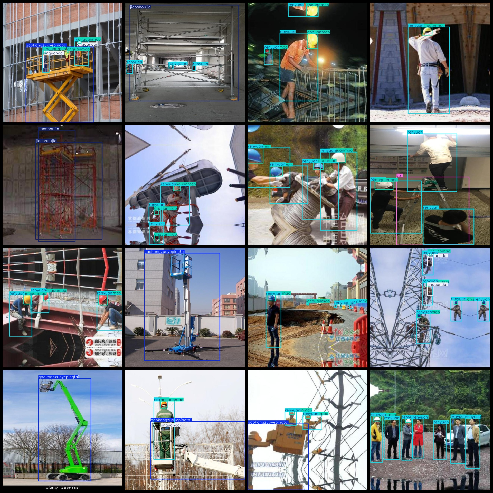
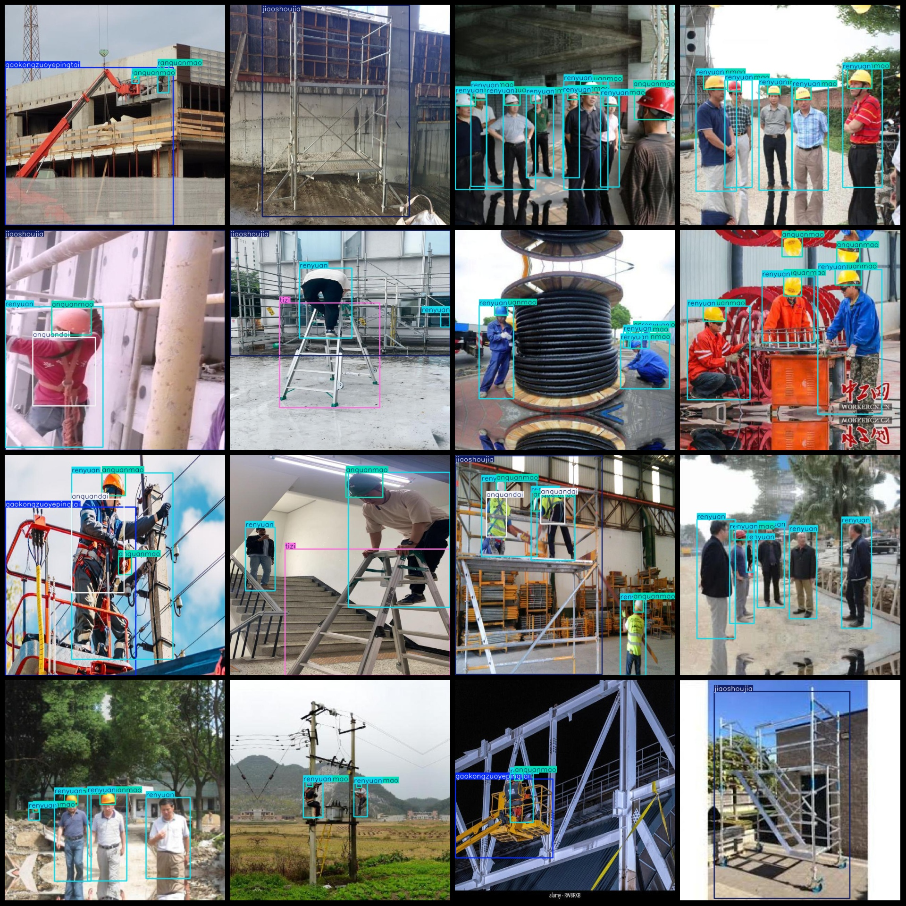

# High-altitude Workplace Safety Equipment Dataset with VOC+YOLO format, 12661 images in 6 categories

## Data Format
- Pascal VOC format
- YOLO format

- Number of images (jpg files): 12661
- Number of annotations (xml files): 12661
- Number of annotations (txt files): 12661
- Number of annotation categories: 6
- List of annotation category names: ["anquandai", "anquanmao", "gaokongzuoyepingtai", "jiaoshoujia", "renyuan", "tizi"]

The total number of frames in each category Annotation is:
- Anquandai (safety belt) frame count = 4,133, occupying 2,958 images
- Anquanmao (safety cap) frame count = 25,817, occupying 8,523 images
- Gaokongzuoyepingtai (high-altitude work platform) frame count = 2500, occupying 2,017 images
- Jiaoshoujia (scaffolding) frame count = 3,200, occupying 3,017 images
- Renyuan (personnel) frame count = 28,808, occupying 10,150 images
- Tizi (ladder) frame count = 2,229, occupying 1,979 images
- Total frame count: 66,687

## Images resolution: 640x640

Using the Annotation Tool: labelImg

Annotation rule: draw a rectangle around the class.

## Important Note: The dataset does not have a division into training validation test sets.

## Special Disclaimer: This dataset does not guarantee the accuracy of the trained model or weight files.

## Images Preview:
[Insert image preview link here]
## Images

Here is a pay link on Stripe ( https://buy.stripe.com/3cs8yP7sY87d0vu9AB ). Please contact me lonlonago@foxmail.com after funding $89, and I will send you a complete data files , thank you!

